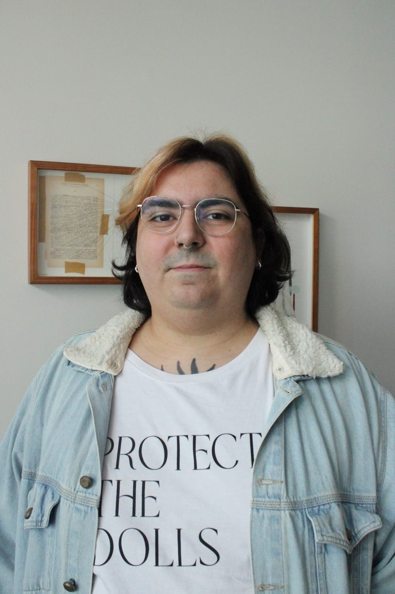

```{=html}

<div class="hero-split">

<!-- LEFT SIDE -->
  <div class="hero-left">
    <h1 class="name">Ellie Bastos Degobi</h1>
    <p class="tagline">Psychometrics · Mental Health · Meta-Science · Causal Inference</p>
    <div class="social-links">
      <a href="https://github.com/elliedegb" target="_blank">GitHub</a>
      <a href="https://www.linkedin.com/in/ellie-bastos/" target="_blank">LinkedIn</a>
      <a href="https://bsky.app/profile/elliebastos.bsky.social" target="_blank">Bluesky</a>
      <a href="mailto:elliedegb@gmail.com">Email</a>
      <a href="https://www.researchgate.net/profile/Ellie-Bastos" target="_blank">ResearchGate</a>
      <a href="https://scholar.google.com.br/citations?user=ozWbHFsAAAAJ&hl=pt-BR" target="_blank">Scholar</a>
      <a href="https://orcid.org/0000-0003-2444-6982" target="_blank">Orcid</a>
    </div>
      <a href="/cv.pdf" class="btn">Download CV</a>
    <br>
  </div>

<!-- LANGUAGES -->
<div class="languages">
  <p class="languages-title">Languages</p>
  <div class="languages-list">
    <span>🇧🇷 Portuguese (native)</span>
    <span>🇺🇸 English (C1)</span>
    <span>🇳🇴 Norwegian (Learning)</span>
  </div>
</div>

  <!-- RIGHT SIDE (PHOTO) -->
<div class="hero-right">

  <div class="about-row">
    <div class="about-text">
      <p>
        I am a psychologist (PhD) specialized in psychometrics, mental health, causal inference, and quantitative methods. My work focuses on improving research quality through rigorous statistical modeling and reproducible science.
      </p>
    </div>
  </div>

</div>

</div>

<!-- FLOW SECTIONS -->

<div class="feature right">
  <div class="feature-text">
    <h2>Biography</h2>
    <p>
      I left a small town in Bahia (Brazil) to go to Rio de Janeiro (Brazil) in 2016 to pursue an undergraduate degree in Psychology (2016-2021; PUC-Rio). After that, I moved on to Campinas (São Paulo - BR) to pursue an MSc in Psychology (2021-2022; São Francisco University, BR). I then completed a PhD in Psychology (2023-2025; São Francisco University, BR), specifically on psychometrics, causality and measurement theory. 

During and after obtaining my PhD, I have worked in laboratories at the Oslo New University College, Pontifical Catholic University of Rio Grande do Sul, and São Francisco University, and worked as an independent consultant at Child Mind Institute (USA).
    </p>
  </div>
  <div class="feature-image">
    
  </div>
</div>

<div class="feature left">
  <div class="feature-text">
    <h2>Education</h2>
    <ul>
      <li>PhD in Psychology – São Francisco University (2023–2025)</li>
      <li>MSc in Psychology – São Francisco University (2021–2023)</li>
      <li>BSc in Psychology – Pontifical Catholic University of Rio de Janeiro (2016–2021)</li>
    </ul>
  </div>
  <div class="feature-image">
    
  </div>
</div>

<div class="feature right">
  <div class="feature-text">
    <h2>Research Interests</h2>
    <p> 
    If you are interested in working with me, feel free to <a href="mailto:elliedegb@gmail.com" target="_blank"> contact me</a>.
    Prior to that, it might be worth taking a look at the following themes of research that currently interest me:
</p>

<ul>
  <li>
    <strong>Thinking about Psychometrics By Acting on its Assumptions</strong> — (e.g. My PhD Dissertation; 
    <a href="https://doi.org/10.1007/s43076-022-00183-6" target="_blank">Franco et al., 2024</a>; 
  <a href="https://doi.org/10.1590/1982-4327e3223" target="_blank">Franco et al., 2022</a>
   
  <a href="https://doi.org/10.1590/1413-82712023280403 " target="_blank">Franco et al., 2023</a>
    ).
  </li>

  <li>
    <strong>Mental Health Assessment and Theory</strong> — 
    (<a href="https://doi.org/10.1186/s40359-025-03400-w" target="_blank">Dahlgren et al., 2025</a>; 
  <a href="https://doi.org/10.1186/s41687-026-01032-1" target="_blank">Simioni et al., 2026</a>
   
  <a href="https://doi.org/10.1186/s40337-024-01151-4" target="_blank">Lie et al., 2024</a>)
    </li>

  <li>
    <strong>Replications and Theory Building</strong> — 
     (<a href="https://doi.org/10.15626/MP.2023.3960" target="_blank">Borborema et al., 2026</a>; 
  <a href="https://doi.org/10.1016/j.joep.2024.102744" target="_blank">Ferreira et al., 2024</a>) </li>
</ul>
  </div>
  <div class="feature-image">
    
  </div>
</div>
```